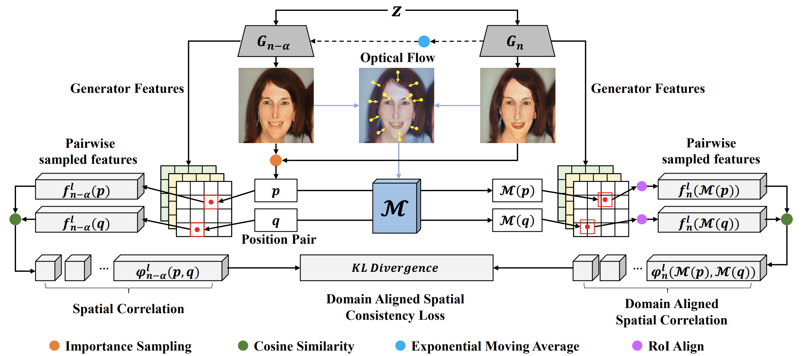

# [AAAI '23] Progressive Few-Shot Adaptation of Generative Model with Align-Free Spatial Correlation

Official PyTorch implementation of ASC adaptation.

### [Paper](https://ojs.aaai.org/index.php/AAAI/article/view/25283)

## Overall framework



**Note:** The base model is taken from [Few-shot-gan-adaptation](https://github.com/utkarshojha/few-shot-gan-adaptation)

- Linux
- NVIDIA GPU + CUDA CuDNN 10.2
- PyTorch 1.7.0
- Python 3.6.9
- Install all the libraries through `pip install -r requirements.txt` 

## Training
### Pretrained Source domain model
- [FFHQ](https://drive.google.com/file/d/1TQ_6x74RPQf03mSjtqUijM4MZEMyn7HI/view?usp=sharing)
**Note:** Please download it into your training <root> path. 


### Dataset for training
10 shot

- [Sketches](https://drive.google.com/file/d/1nfnop7Gd0WsWlrLxVmBGU7Kf8UdRlBo-/view?usp=sharing) | [Amedeo Modigliani](https://drive.google.com/file/d/1bJYBk6mtyABmpWNTHGzZPukEkWmuyyvh/view?usp=sharing) | [Babies](https://drive.google.com/file/d/18DJLNbvuqcn6AK_KzaU9aJ9k3eLqcAQQ/view?usp=sharing) | [Sunglasses](https://drive.google.com/file/d/1b2tvd7XadSvPRknDa6dqXuB8yWIhAgij/view?usp=sharing) | [Animation faces](https://drive.google.com/file/d/19sAiMnWAzoDYgZc0IL22Is3wky6Xs4Fn/view?usp=sharing)

5 shot

- [Sketches](https://drive.google.com/file/d/1K0nVkWZHBTxqLTYI9jxtE0XGNS3f3mKR/view?usp=sharing) | [Amedeo Modigliani ](https://drive.google.com/file/d/1DYkfW2amch5rw1VnjQYEfWMt4CgxsyZs/view?usp=sharing) | [Babies](https://drive.google.com/file/d/11-6AV_NXwW7un5NKxcnLMOjuL_6tVI9T/view?usp=sharing) | [Sunglasses](https://drive.google.com/file/d/109Ay1rI-8AjLORV8Ffj78aDrOsU4GEUK/view?usp=sharing) | [Animation faces](https://drive.google.com/file/d/19sAiMnWAzoDYgZc0IL22Is3wky6Xs4Fn/view?usp=sharing)

**Note:** Please download it into your training <root/raw_data> path. 

```bash
python prepare_data.py --out ./processed_data/<dataset_name> --size 256 ./raw_data/<dataset_name>
```

```bash
CUDA_VISIBLE_DEVICES=0 python train.py --ckpt_source /path/to/source_model --data_path /path/to/target_data --exp <exp_name> \
    --use_ema --use_rel_ema --k 1.0 --extra_ema \
    --use_flow --winsize_inc 1.0002 --winsize 16 --cutoff 0.6 \
    --use_pred --pred_noiseW 2.0 --use_flow_pred --blur 7 \
    --LFC --m 2 --LFCw 0.5 --extra_step 0
```

## Evaluating
### Dataset for FID evaluating 

- Sketches test set from [Few-shot-gan-adaptation](https://github.com/utkarshojha/few-shot-gan-adaptation) --> [link](https://drive.google.com/file/d/1vgsB7ji-cLVzRhx43DvNSDgV5Up3jFJ2/view?usp=sharing)
- Babies test set from [Few-shot-gan-adaptation](https://github.com/utkarshojha/few-shot-gan-adaptation) --> [link](https://drive.google.com/file/d/1JmjKBq_wylJmpCQ2OWNMy211NFJhHHID/view?usp=sharing)
- Sunglassies test set from [Few-shot-gan-adaptation](https://github.com/utkarshojha/few-shot-gan-adaptation) --> [link](https://drive.google.com/file/d/1Uu5y_y8Rjxbj2VEzvT3aBHyn4pltFgyX/view?usp=sharing)
- Animation Faces test set from [AniGAN](https://github.com/bing-li-ai/AniGAN) --> [link](https://drive.google.com/file/d/1Exc6QumR2r0aFUtfHOdAgle4F4I9zwF3/view?usp=sharing)

```bash
# if there is a large dataset of the target, use --test_imgs for FID evaluation
# if not, please remove this option. 
CUDA_VISIBLE_DEVICES=0 python evals.py --ckpt_source /path/to/source_model --model_ckpt /path/to/target_model \
    --out /path/to/out --train_imgs /path/to/processed_data/domain --source_key <domain_key> \
    --batch 64 --n_sample <test_sample_count> --seed <number> --test_imgs /path/raw_data/domain/images/
```

### Dataset for Reconstruction evaluating

**Note:** To evaluate identity, please training source to target first, then try to re-train it to FFHQ again with this following ffhq-10s images:

- [ffhq-10s](https://drive.google.com/file/d/1K0nVkWZHBTxqLTYI9jxtE0XGNS3f3mKR/view?usp=sharing)

#### After finish the reconstruction (source -> target -> source), evaluate it as this following step:

```bash
# if there is a large dataset of the target, use --test_imgs for FID evaluation
# if not, please remove this option. 
CUDA_VISIBLE_DEVICES=0 python evals.py --ckpt_source /path/to/source_model --model_ckpt /path/to/target_model \
    --out /path/to/out --train_imgs /path/to/processed_data/domain --source_key <domain_key> \
    --batch 64 --n_sample <test_sample_count> --seed <number> --test_imgs /path/raw_data/domain/images/
    
CUDA_VISIBLE_DEVICES=0 python recon_evals.py --source_ckpt /path/to/source_model --model_ckpt /path/to/target_model \
   --out /path/to/out --source_key <domain_key> \
   --batch 4 --n_sample <test_sample_count> --seed <number>
```


